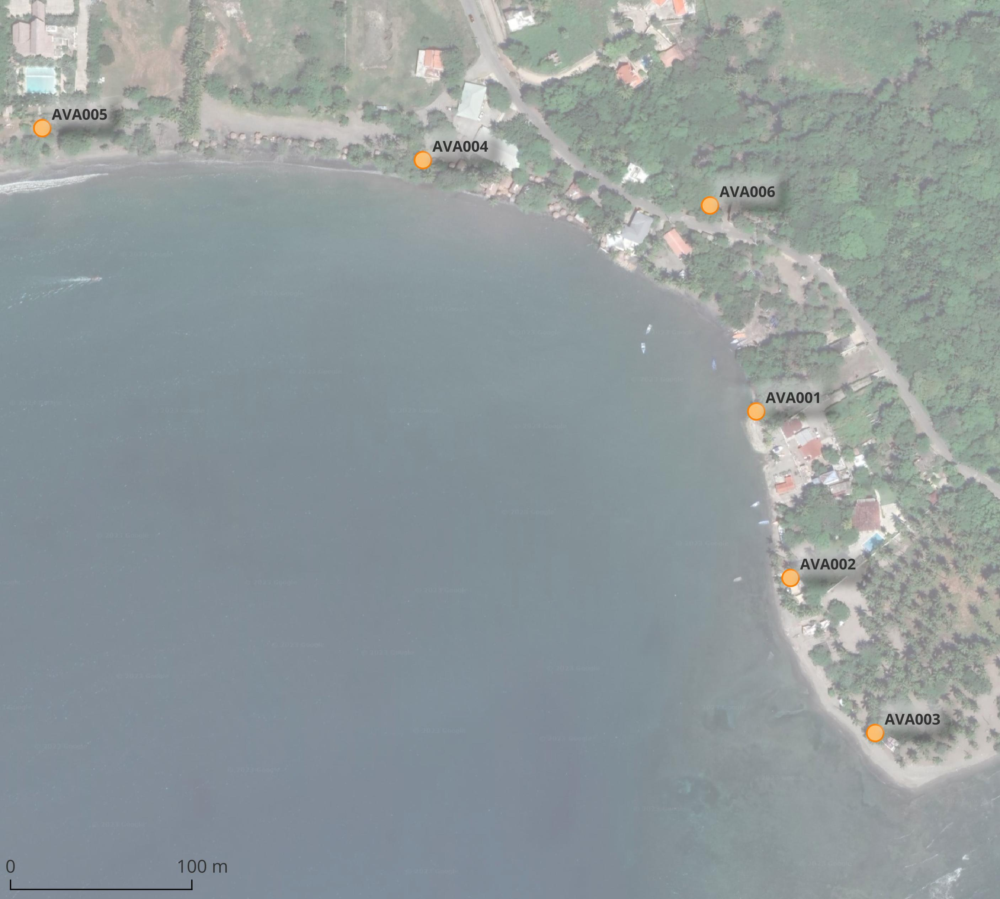

```{r setup, include=FALSE}
knitr::opts_chunk$set(echo = TRUE, fig.width = 11, fig.height = 8)
```

## Paquetes y funciones

```{r}
# remotes::install_github("bceaton/GSDtools")
library(GSDtools)
library(kableExtra)
library(tidyverse)
source('R/funciones.R')
```

## Datos

```{r}
datos_orig <- leer_tabla('pesos_granulometria_playa_palenque.ods')
```

## Obtener dimensiones *phi* a partir de mm

```{r}
pesos_tamanos <- datos_orig[-7,] #Quitando última fila
(pesos_tamanos$micrones <- as.numeric(pesos_tamanos$micrones)) # Convertida a numérica
(pesos_tamanos$mm <- pesos_tamanos$micrones / 1000) # Convertida a numérica
(pesos_tamanos$phi <- round(obtener_phi(pesos_tamanos$mm), 1)) #Crear columna de diámetro
#Conservando columnas de interés
pesos_tamanos_mm_phi <- pesos_tamanos[, c('mm', 'phi', grep('^A', colnames(pesos_tamanos), value = T))]
# Imprimir con kable
pesos_tamanos_mm_phi %>%
  kable(booktabs=T) %>%
  kable_styling(latex_options = c("HOLD_position", "scale_down")) %>%
  gsub(' NA ', '', .)
```

## Generar frecuencias acumuladas

```{r}
# Copiando objeto
pesos_tamanos_mm_phi_rel <- pesos_tamanos_mm_phi
# Columnas de pesos relativos
pesos_tamanos_mm_phi_rel[, grep('^A', colnames(pesos_tamanos_mm_phi_rel))] <- sapply(
  pesos_tamanos_mm_phi_rel[, grep('^A', colnames(pesos_tamanos_mm_phi_rel))],
  function(x) x/sum(x)*100)
# Columnas de pesos relativos acumulados
pesos_tamanos_mm_phi_rel_acum <- sapply(
  pesos_tamanos_mm_phi_rel[, grep('^A', colnames(pesos_tamanos_mm_phi_rel))],
  function(x) cumsum(x))
# Añadiendo "_acum" a nombre de columnas correspondientes
colnames(pesos_tamanos_mm_phi_rel_acum) <- paste0(colnames(pesos_tamanos_mm_phi_rel_acum), '_acum')
# cbind para unir tabla de valores relativos con acumulados
pesos_tamanos_mm_phi_rel_acum_unido <- cbind(pesos_tamanos_mm_phi_rel, pesos_tamanos_mm_phi_rel_acum)
# Imprimiendo con kable
pesos_tamanos_mm_phi_rel_acum_unido  %>%
  kable(booktabs=T, digits = 3) %>%
  kable_styling(latex_options = c("HOLD_position", "scale_down")) %>%
  gsub(' NA ', '', .)
pesos_tamanos_mm_phi_rel_acum_unido <- rbind(
  c(8, obtener_phi(8), rep(0,12)),
  pesos_tamanos_mm_phi_rel_acum_unido)
# write_csv(pesos_tamanos_mm_phi_rel_acum_unido, 'pesos_tamanos_mm_phi_rel_acum_unido.csv')
```

## Generar curvas de tamaño de grano de frecuencias acumuladas suavizadas

Adaptado de: https://rpubs.com/manchulu/706871

- Usando phi

```{r}
if(interactive()) dev.new()
par(mfrow = c(2, 3))
lapply(
  grep('AVA[0-9]{3,}$', colnames(pesos_tamanos_mm_phi_rel_acum_unido), value = T),
  function(x) crear_grafico(x))
```

- Usando mm

```{r}
if(interactive()) dev.new()
par(mfrow = c(2, 3))
lapply(
  grep('AVA[0-9]{3,}$', colnames(pesos_tamanos_mm_phi_rel_acum_unido), value = T),
  function(x) crear_grafico(x, phi=F))
```


## Mapa


