Posprocesamiento de líneas de costa creadas en Earth Engine
================
Ana Valera, Carolain Pérez, Yulisa Arias, José Martínez (tali)
2023-02-16


# Representar líneas de costa, transectos, EPR

## Cargar paquetes y funciones

``` r
library(tidyverse)
```

    ## ── Attaching packages ─────────────────────────────────────── tidyverse 1.3.1 ──

    ## ✔ ggplot2 3.3.5      ✔ purrr   0.3.4 
    ## ✔ tibble  3.1.7      ✔ dplyr   1.0.10
    ## ✔ tidyr   1.2.1      ✔ stringr 1.4.0 
    ## ✔ readr   2.1.3      ✔ forcats 0.5.1

    ## ── Conflicts ────────────────────────────────────────── tidyverse_conflicts() ──
    ## ✖ dplyr::filter() masks stats::filter()
    ## ✖ dplyr::lag()    masks stats::lag()

``` r
library(coastr)
library(sf)
```

    ## Linking to GEOS 3.10.2, GDAL 3.4.3, PROJ 8.2.0; sf_use_s2() is TRUE

``` r
library(lubridate)
```

    ## 
    ## Attaching package: 'lubridate'

    ## The following objects are masked from 'package:base':
    ## 
    ##     date, intersect, setdiff, union

``` r
library(RColorBrewer)
library(zoo)
```

    ## 
    ## Attaching package: 'zoo'

    ## The following objects are masked from 'package:base':
    ## 
    ##     as.Date, as.Date.numeric

``` r
# Función para clasificar las partes de los transectos en mar o tierra respecto de referencia
devtools::source_url('https://raw.githubusercontent.com/geofis/RCoastSat/master/R/classify-transects.R')
```

    ## ℹ SHA-1 hash of file is c5f094a166aafc99756ca04c86ac436dba34b942

``` r
# Función para calcular la distancia de cada línea de costa respecto de la de referencia sobre cada transecto
devtools::source_url('https://raw.githubusercontent.com/geofis/RCoastSat/master/R/extract-points-distances.R')
```

    ## ℹ SHA-1 hash of file is 1625bf00e42b93784549e9c6c5599ae0aa813ed1

``` r
# Función para suavizar el relleno de los gráficos de series temporales
devtools::source_url('https://raw.githubusercontent.com/geofis/RCoastSat/master/R/interpolate.R')
```

    ## ℹ SHA-1 hash of file is 51da8bcb0f875d3cd9ca72fa0a2e6a4435cacd06

``` r
# La línea siguiente fija el tamaño de los gráficos a unas proporciones "razonables". Editar a conveniencia
```

## Pre-2009

### Tramo Este

- Cargar líneas de costa

``` r
lineas <- st_read('lineas-de-costa/PalenqueNizaoPC_L5_output_lines.gpkg') %>%
  filter(grepl('palenque', tramo, ignore.case = T)) %>%
  st_cast('LINESTRING')
```

    ## Reading layer `PalenqueNizaoPC_L5_output_lines' from data source 
    ##   `/home/jose/Documentos/git/tesis-ana-carolain/lineas-de-costa/PalenqueNizaoPC_L5_output_lines.gpkg' 
    ##   using driver `GPKG'
    ## replacing null geometries with empty geometries
    ## Simple feature collection with 51 features and 5 fields (with 1 geometry empty)
    ## Geometry type: LINESTRING
    ## Dimension:     XY
    ## Bounding box:  xmin: 368865 ymin: 2015212 xmax: 377395.8 ymax: 2016785
    ## Projected CRS: WGS 84 / UTM zone 19N

``` r
st_geometry(lineas) <- "geometry"
lineas$longitud <- units::drop_units(st_length(lineas))
lineas <- lineas[lineas$longitud > 0, ]
```

- Representar las líneas de costa

``` r
lineas$intervalo_en_dias <- round(as.numeric(interval(lineas$date, max(lineas$date)), 'days'), 0)
escala_color <- 'BrBG'
mapa_lineas <- lineas %>% ggplot + aes(color=intervalo_en_dias) + geom_sf() +
  theme_minimal() +
  theme(text = element_text(size = 18)) +
  scale_color_gradientn(colors = rev(RColorBrewer::brewer.pal(11, escala_color)))
mapa_lineas
```

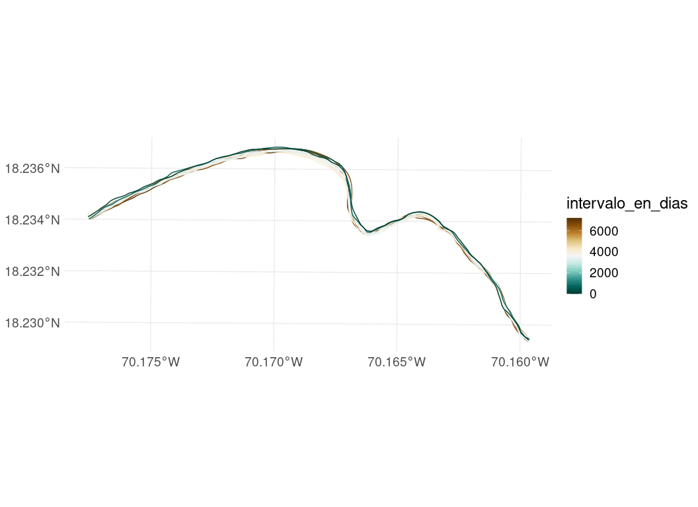<!-- -->

- Crear transectos respecto de línea de costa de referencia y
  representarlos

``` r
# Umbral de longitud para líneas que podrían usarse como referencia
umbral_longitud <- 1000

# Elegir una línea de referencia
linea_ref <- lineas %>% filter(longitud > umbral_longitud) %>% filter(date == min(date))

# Crear transectos
transectos <- create_transect(x = linea_ref, 200, reverse = T) %>% rename(transect=coastr_id)

# Mapa
mapa_lineas + geom_sf(data = transectos, color = 'blue')
```

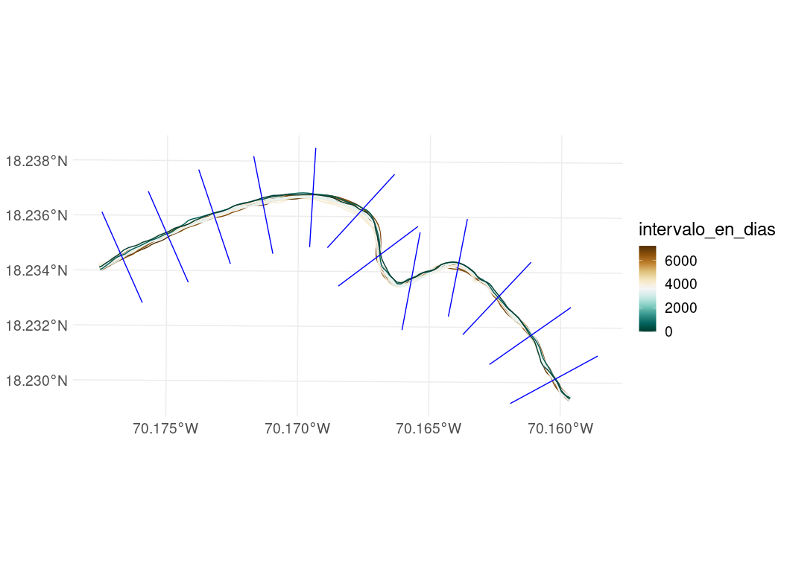<!-- -->

- Clasificar las distintas partes del transecto en tierra o mar

``` r
transectos_clasif <- transclas(tr = transectos, rl = linea_ref)
```

    ## Warning: attribute variables are assumed to be spatially constant throughout all
    ## geometries

    ## Warning: attribute variables are assumed to be spatially constant throughout all
    ## geometries

    ## Warning in st_cast.sf(tmultiline, "LINESTRING"): repeating attributes for all
    ## sub-geometries for which they may not be constant

``` r
cols <- colorRampPalette(brewer.pal(9,'Set1'))(nrow(lineas))
ggplot() +
  geom_sf(data = lineas %>% mutate(date = factor(date)), color = cols) +
  geom_sf(
    data = linea_ref %>% mutate(linetype = paste0('Ref. (', date, ')')),
    aes(color=linetype), linewidth = 2, show.legend = 'line') +
  geom_sf(
    data = transectos_clasif %>% mutate(sealand=paste0('Transect: ', sealand)),
    aes(color = sealand), show.legend = 'line', linewidth = 4) +
  scale_color_manual(values = c('black', 'orange', 'blue')) +
  geom_sf_text(
    data = transectos_clasif %>% filter(sealand=='landward') %>%
      st_centroid, aes(label = transect), size = 8) +
  theme_minimal() +
  theme(legend.title = element_blank(), text = element_text(size = 18))
```

    ## Warning: Ignoring unknown parameters: linewidth

    ## Warning: Ignoring unknown parameters: linewidth

    ## Warning in st_centroid.sf(.): st_centroid assumes attributes are constant over
    ## geometries of x

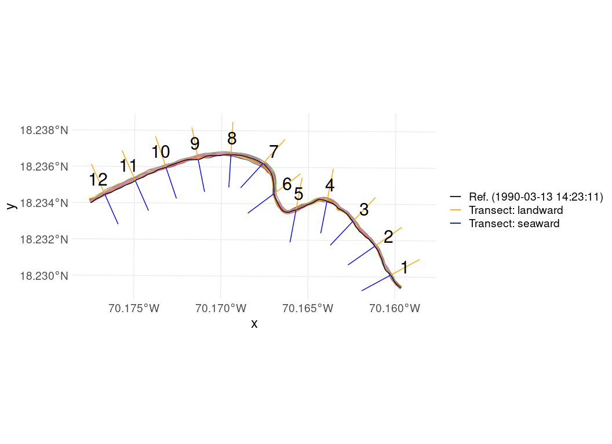<!-- -->

- Calcular distancias de cada línea de costa respecto de la línea de
  referencia

``` r
distl <- pointdist(sh = lineas, re = linea_ref, tr = transectos_clasif, rtr = transectos)
```

    ## Warning: attribute variables are assumed to be spatially constant throughout all
    ## geometries

    ## Warning: attribute variables are assumed to be spatially constant throughout all
    ## geometries

- Generar las series temporales de distancia de la línea de costa
  respecto a la de referencia

``` r
interdist <- map(distl, interpolate) %>% plyr::ldply() %>% mutate(date = as.Date(date, "%Y-%m-%d"))
distances <- plyr::ldply(distl) %>% mutate(date = as.Date(date, "%Y-%m-%d"))
distances %>% 
  ggplot() + theme_bw() + aes(x = date, y = distance_sign) +
  geom_ribbon(data = interdist, aes(ymax = pmax(distance_sign, 0), ymin = 0), fill = "sienna3") +
  geom_ribbon(data = interdist, aes(ymin = pmin(distance_sign, 0), ymax = 0), fill = "skyblue3") +
  geom_hline(yintercept = 0, color = 'grey') +
  geom_line(colour='black', lwd = 0.5) +
  scale_x_date(date_labels = "%Y", date_breaks = '1 year') +
#   scale_y_continuous(limits = c(-30, 30)) +
  theme(axis.text.x = element_text(angle = 90, vjust = 0.5), text = element_text(size = 14)) +
  facet_wrap(~transect, ncol = 2)
```

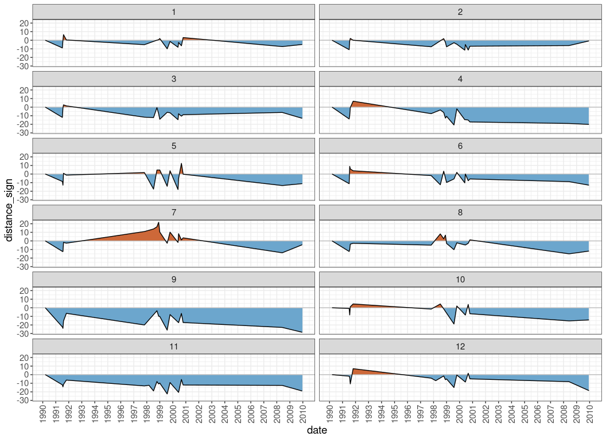<!-- -->

- Revisión de seguridad: determinar si hay transectos que corten dos
  veces una misma línea de costa

``` r
test <- sapply(unique(distances$transect), function(x) {
    conteo_cortes <- table(distances[distances$transect==x, 'date', drop=T])
    mas_de_1 <- length(which(conteo_cortes>1))>0
    ifelse(mas_de_1,
          paste('El transecto', x, 'corta', conteo_cortes[which(conteo_cortes>1)],
                 'veces la línea de costa de fecha', names(conteo_cortes[which(conteo_cortes>1)])),
          paste('El transecto', x, 'pasa la prueba'))
})
test
```

    ##  [1] "El transecto 1 pasa la prueba"  "El transecto 2 pasa la prueba" 
    ##  [3] "El transecto 3 pasa la prueba"  "El transecto 4 pasa la prueba" 
    ##  [5] "El transecto 5 pasa la prueba"  "El transecto 6 pasa la prueba" 
    ##  [7] "El transecto 7 pasa la prueba"  "El transecto 8 pasa la prueba" 
    ##  [9] "El transecto 9 pasa la prueba"  "El transecto 10 pasa la prueba"
    ## [11] "El transecto 11 pasa la prueba" "El transecto 12 pasa la prueba"

- Suavizado de la serie con media móvil

``` r
ventana_de_promediado <- 3 #Número de observaciones para obtener la media movil (ventana de promediado)
distl_med <- sapply(unique(distances$transect),
       function(x){
           df <- distances[distances$transect==x, ]
           df <- df[order(df$date), ]
           x <- zoo(df$distance_sign, df$date)
           mm <- as.numeric(rollmean(x, ventana_de_promediado, fill = NA))
           df$distance_sign <- mm
           df <- df #%>% slice(1:(n()-1))
           return(df)
       }, simplify=F)
interdist_med <- map(distl_med, interpolate) %>% plyr::ldply() %>% mutate(date = as.Date(date, "%Y-%m-%d"))
distances_med <- plyr::ldply(distl_med) %>% mutate(date = as.Date(date, "%Y-%m-%d"))
```

- Representación de la serie suavizada

``` r
distances_med %>% 
  ggplot() + theme_bw() + aes(x = date, y = distance_sign) +
  geom_ribbon(data = interdist_med, aes(ymax = pmax(distance_sign, 0), ymin = 0), fill = "sienna3") +
  geom_ribbon(data = interdist_med, aes(ymin = pmin(distance_sign, 0), ymax = 0), fill = "skyblue3") +
  geom_hline(yintercept = 0, color = 'grey') +
  geom_line(colour='black', lwd = 0.5) +
  scale_x_date(date_labels = "%Y", date_breaks = '1 year') +
  theme(axis.text.x = element_text(angle = 90, vjust = 0.5), text = element_text(size = 14)) +
  facet_wrap(~transect, ncol = 2)
```

    ## Warning: Removed 2 row(s) containing missing values (geom_path).

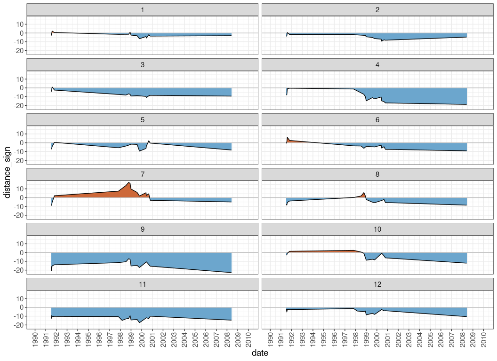<!-- -->

### Tramo Oeste

> Nota: el suavizado, para este tramo, no funciona adecuadamente.

- Cargar líneas de costa

``` r
lineas <- st_read('lineas-de-costa/PalenqueNizaoPC_L5_output_lines.gpkg') %>%
  filter(grepl('nizao', tramo, ignore.case = T)) %>%
  st_cast('LINESTRING')
```

    ## Reading layer `PalenqueNizaoPC_L5_output_lines' from data source 
    ##   `/home/jose/Documentos/git/tesis-ana-carolain/lineas-de-costa/PalenqueNizaoPC_L5_output_lines.gpkg' 
    ##   using driver `GPKG'
    ## replacing null geometries with empty geometries
    ## Simple feature collection with 51 features and 5 fields (with 1 geometry empty)
    ## Geometry type: LINESTRING
    ## Dimension:     XY
    ## Bounding box:  xmin: 368865 ymin: 2015212 xmax: 377395.8 ymax: 2016785
    ## Projected CRS: WGS 84 / UTM zone 19N

``` r
st_geometry(lineas) <- "geometry"
lineas$longitud <- units::drop_units(st_length(lineas))
lineas <- lineas[lineas$longitud > 0, ]
```

- Representar las líneas de costa

``` r
lineas$intervalo_en_dias <- round(as.numeric(interval(lineas$date, max(lineas$date)), 'days'), 0)
escala_color <- 'BrBG'
mapa_lineas <- lineas %>% ggplot + aes(color=intervalo_en_dias) + geom_sf() +
  theme_minimal() +
  theme(text = element_text(size = 18)) +
  scale_color_gradientn(colors = rev(RColorBrewer::brewer.pal(11, escala_color)))
mapa_lineas
```

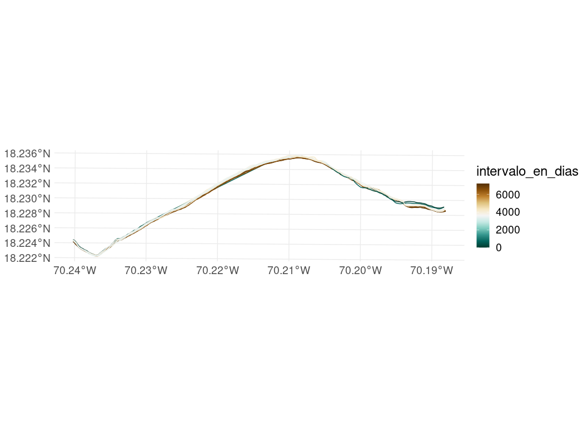<!-- -->

- Crear transectos respecto de línea de costa de referencia y
  representarlos

``` r
# Umbral de longitud para líneas que podrían usarse como referencia
umbral_longitud <- 1000

# Elegir una línea de referencia
linea_ref <- lineas %>% filter(longitud > umbral_longitud) %>% filter(date == min(date))

# Crear transectos
transectos <- create_transect(x = linea_ref, 500, reverse = T) %>% rename(transect=coastr_id)

# Mapa
mapa_lineas + geom_sf(data = transectos, color = 'blue')
```

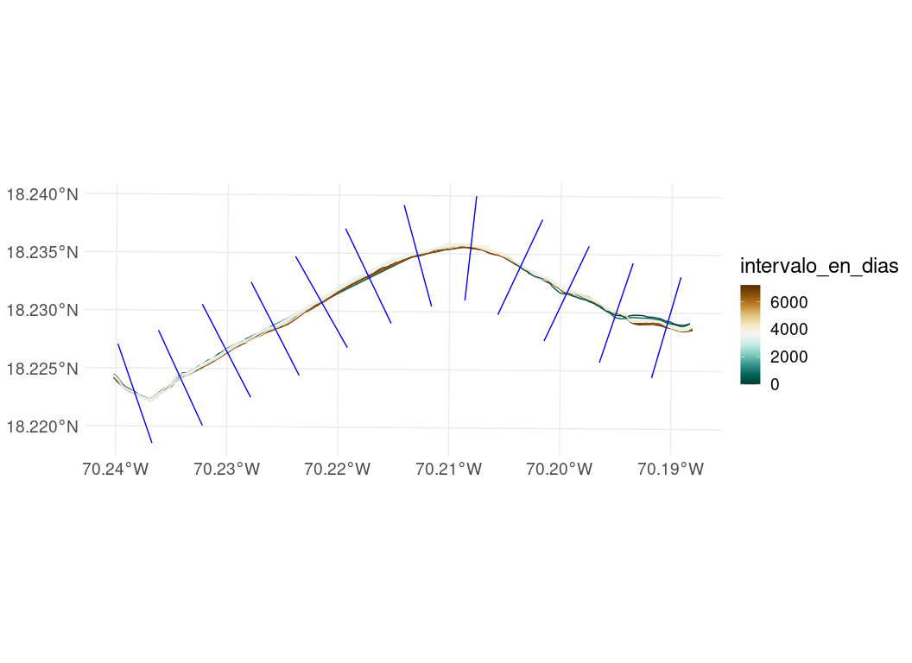<!-- -->

- Clasificar las distintas partes del transecto en tierra o mar

``` r
transectos_clasif <- transclas(tr = transectos, rl = linea_ref)
```

    ## Warning: attribute variables are assumed to be spatially constant throughout all
    ## geometries

    ## Warning: attribute variables are assumed to be spatially constant throughout all
    ## geometries

    ## Warning in st_cast.sf(tmultiline, "LINESTRING"): repeating attributes for all
    ## sub-geometries for which they may not be constant

``` r
cols <- colorRampPalette(brewer.pal(9,'Set1'))(nrow(lineas))
ggplot() +
  geom_sf(data = lineas %>% mutate(date = factor(date)), color = cols) +
  geom_sf(
    data = linea_ref %>% mutate(linetype = paste0('Ref. (', date, ')')),
    aes(color=linetype), linewidth = 2, show.legend = 'line') +
  geom_sf(
    data = transectos_clasif %>% mutate(sealand=paste0('Transect: ', sealand)),
    aes(color = sealand), show.legend = 'line', linewidth = 4) +
  scale_color_manual(values = c('black', 'orange', 'blue')) +
  geom_sf_text(
    data = transectos_clasif %>% filter(sealand=='landward') %>%
      st_centroid, aes(label = transect), size = 8) +
  theme_minimal() +
  theme(legend.title = element_blank(), text = element_text(size = 18))
```

    ## Warning: Ignoring unknown parameters: linewidth

    ## Warning: Ignoring unknown parameters: linewidth

    ## Warning in st_centroid.sf(.): st_centroid assumes attributes are constant over
    ## geometries of x

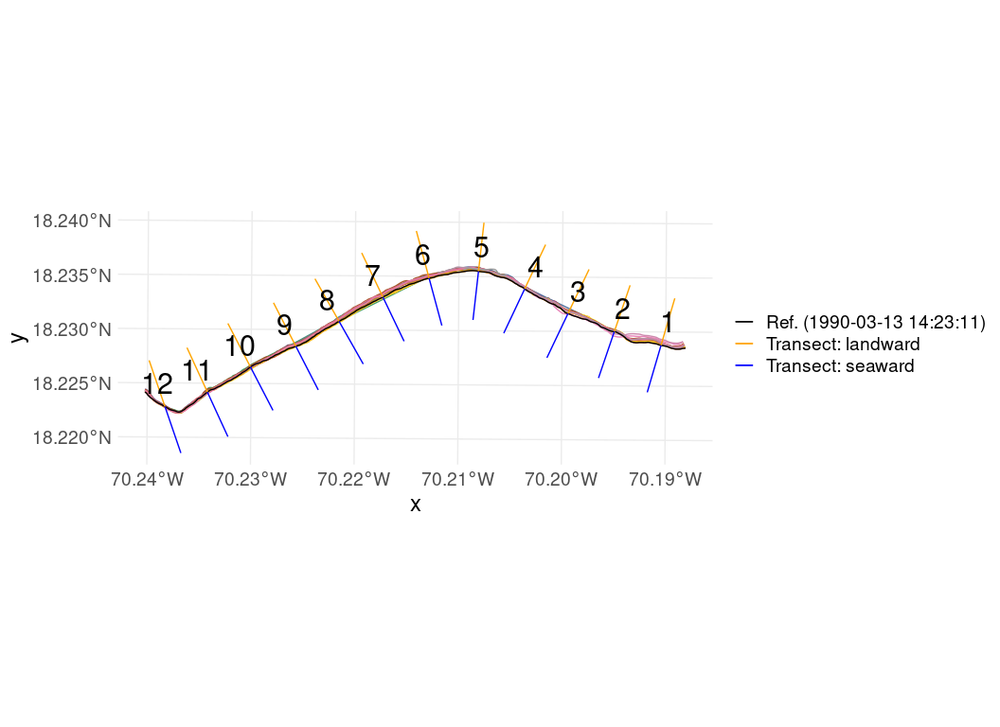<!-- -->

- Calcular distancias de cada línea de costa respecto de la línea de
  referencia

``` r
distl <- pointdist(sh = lineas, re = linea_ref, tr = transectos_clasif, rtr = transectos)
```

    ## Warning: attribute variables are assumed to be spatially constant throughout all
    ## geometries

    ## Warning: attribute variables are assumed to be spatially constant throughout all
    ## geometries

- Generar las series temporales de distancia de la línea de costa
  respecto a la de referencia

``` r
interdist <- map(distl, interpolate) %>% plyr::ldply() %>% mutate(date = as.Date(date, "%Y-%m-%d"))
distances <- plyr::ldply(distl) %>% mutate(date = as.Date(date, "%Y-%m-%d"))
distances %>% 
  ggplot() + theme_bw() + aes(x = date, y = distance_sign) +
  geom_ribbon(data = interdist, aes(ymax = pmax(distance_sign, 0), ymin = 0), fill = "sienna3") +
  geom_ribbon(data = interdist, aes(ymin = pmin(distance_sign, 0), ymax = 0), fill = "skyblue3") +
  geom_hline(yintercept = 0, color = 'grey') +
  geom_line(colour='black', lwd = 0.5) +
  scale_x_date(date_labels = "%Y", date_breaks = '1 year') +
#   scale_y_continuous(limits = c(-30, 30)) +
  theme(axis.text.x = element_text(angle = 90, vjust = 0.5), text = element_text(size = 14)) +
  facet_wrap(~transect, ncol = 2)
```

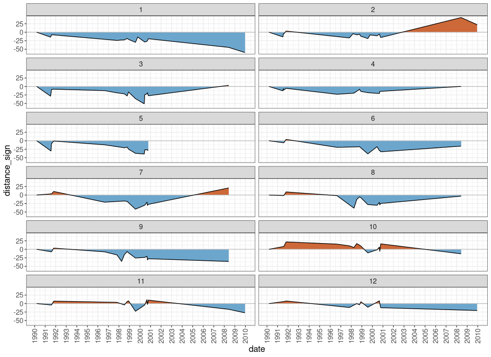<!-- -->

- Revisión de seguridad: determinar si hay transectos que corten dos
  veces una misma línea de costa

``` r
test <- sapply(unique(distances$transect), function(x) {
    conteo_cortes <- table(distances[distances$transect==x, 'date', drop=T])
    mas_de_1 <- length(which(conteo_cortes>1))>0
    ifelse(mas_de_1,
          paste('El transecto', x, 'corta', conteo_cortes[which(conteo_cortes>1)],
                 'veces la línea de costa de fecha', names(conteo_cortes[which(conteo_cortes>1)])),
          paste('El transecto', x, 'pasa la prueba'))
})
test
```

    ##  [1] "El transecto 1 pasa la prueba"  "El transecto 2 pasa la prueba" 
    ##  [3] "El transecto 3 pasa la prueba"  "El transecto 4 pasa la prueba" 
    ##  [5] "El transecto 5 pasa la prueba"  "El transecto 6 pasa la prueba" 
    ##  [7] "El transecto 7 pasa la prueba"  "El transecto 8 pasa la prueba" 
    ##  [9] "El transecto 9 pasa la prueba"  "El transecto 10 pasa la prueba"
    ## [11] "El transecto 11 pasa la prueba" "El transecto 12 pasa la prueba"

- Suavizado de la serie con media móvil

``` r
ventana_de_promediado <- 1 #Número de observaciones para obtener la media movil (ventana de promediado)
distl_med <- sapply(unique(distances$transect),
       function(x){
           df <- distances[distances$transect==x, ]
           df <- df[order(df$date), ]
           x <- zoo(df$distance_sign, df$date)
           mm <- as.numeric(rollmean(x, ventana_de_promediado, fill = NA))
           df$distance_sign <- mm
           df <- df #%>% slice(1:(n()-1))
           return(df)
       }, simplify=F)
interdist_med <- map(distl_med, interpolate) %>% plyr::ldply() %>% mutate(date = as.Date(date, "%Y-%m-%d"))
distances_med <- plyr::ldply(distl_med) %>% mutate(date = as.Date(date, "%Y-%m-%d"))
```

- Representación de la serie suavizada

``` r
distances_med %>% 
  ggplot() + theme_bw() + aes(x = date, y = distance_sign) +
  geom_ribbon(data = interdist_med, aes(ymax = pmax(distance_sign, 0), ymin = 0), fill = "sienna3") +
  geom_ribbon(data = interdist_med, aes(ymin = pmin(distance_sign, 0), ymax = 0), fill = "skyblue3") +
  geom_hline(yintercept = 0, color = 'grey') +
  geom_line(colour='black', lwd = 0.5) +
  scale_x_date(date_labels = "%Y", date_breaks = '1 year') +
  theme(axis.text.x = element_text(angle = 90, vjust = 0.5), text = element_text(size = 14)) +
  facet_wrap(~transect, ncol = 2)
```

<!-- -->

- Cálculo de EPR (*end point rates*)

``` r
calcular_epr <- function(fecha_ref = '2013-06-16', fecha_ini = '2013-06-16', fecha_fin = '2015-04-19',
                         campo_trans = 'transect', trans = 1, campo_fecha = 'date',
                         tabla_dist = distances, campo_dist = 'distance_sign'){
    d_trans <- tabla_dist[tabla_dist[, campo_trans] == trans, ]
    selector_fecha <- d_trans[, campo_fecha, drop = T]
#     selector_trans <- d_trans[, campo_trans, drop = T]
    T <- as.numeric(as.Date(fecha_fin, "%Y-%m-%d") - as.Date(fecha_ini, "%Y-%m-%d"))
    d0 <- tryCatch(as.numeric(d_trans[fecha_ini == selector_fecha, campo_dist, drop = T]))
    d1 <- tryCatch(as.numeric(d_trans[fecha_fin == selector_fecha, campo_dist, drop = T]))
    D <- tryCatch(d1 - d0)
    EPR <- (D/T)*365
    return(EPR)
}
# EPR anual, periodo 1, 2013-06-16 y 2015-04-19
periodo_1 <- c('2013-06-16', '2015-04-19')
epr_periodo_1 <- data.frame(col = sapply(
    paste('Transecto', (1:15)),
    function(x) calcular_epr(trans = as.integer(gsub('Transecto ', '', x))),
    simplify = T)) %>% setNames(paste('EPR anual, periodo 1, desde', periodo_1[1], 'a', periodo_1[2]))
epr_periodo_1

# EPR anual, periodo 2, 2015-04-19 y 2021-01-29
periodo_2 <- c('2015-04-19', '2021-01-29')
epr_periodo_2 <- data.frame(col = sapply(
    paste('Transecto', (1:15)),
    function(x)
        calcular_epr(
            trans = as.integer(gsub('Transecto ', '', x)),
        fecha_ini = periodo_2[1], fecha_fin = periodo_2[2]),
    simplify = T)) %>% setNames(paste('EPR anual, periodo 2, desde', periodo_2[1], 'a', periodo_2[2]))
epr_periodo_2

# EPR anual, periodo 3, 2021-01-29 y 2021-12-15
periodo_3 <- c('2021-01-29', '2021-12-15')
epr_periodo_3 <- data.frame(col = sapply(
    paste('Transecto', (1:15)),
    function(x)
        calcular_epr(
            trans = as.integer(gsub('Transecto ', '', x)),
        fecha_ini = periodo_3[1], fecha_fin = periodo_3[2]),
    simplify = T)) %>% setNames(paste('EPR anual, periodo 2, desde', periodo_3[1], 'a', periodo_3[2]))
epr_periodo_3
```

## Pos-2013 (Landsat 8)

### Tramo Palenque Este

- Cargar líneas de costa

``` r
lineas <- st_read('lineas-de-costa/PalenqueNizaoPC_L8_output_lines.gpkg') %>%
  filter(grepl('palenque este', tramo, ignore.case = T)) %>%
  st_cast('LINESTRING')
```

    ## Reading layer `PalenqueNizaoPC_L8_output_lines' from data source 
    ##   `/home/jose/Documentos/git/tesis-ana-carolain/lineas-de-costa/PalenqueNizaoPC_L8_output_lines.gpkg' 
    ##   using driver `GPKG'
    ## Simple feature collection with 483 features and 5 fields
    ## Geometry type: LINESTRING
    ## Dimension:     XY
    ## Bounding box:  xmin: 368857.5 ymin: 2015230 xmax: 377399 ymax: 2016803
    ## Projected CRS: WGS 84 / UTM zone 19N

``` r
st_geometry(lineas) <- "geometry"
lineas$longitud <- units::drop_units(st_length(lineas))
lineas <- lineas[lineas$longitud > 0, ]
```

- Representar las líneas de costa

``` r
lineas$intervalo_en_dias <- round(as.numeric(interval(lineas$date, max(lineas$date)), 'days'), 0)
escala_color <- 'BrBG'
mapa_lineas <- lineas %>% ggplot + aes(color=intervalo_en_dias) + geom_sf() +
  theme_minimal() +
  theme(text = element_text(size = 18)) +
  scale_color_gradientn(colors = rev(RColorBrewer::brewer.pal(11, escala_color)))
mapa_lineas
```

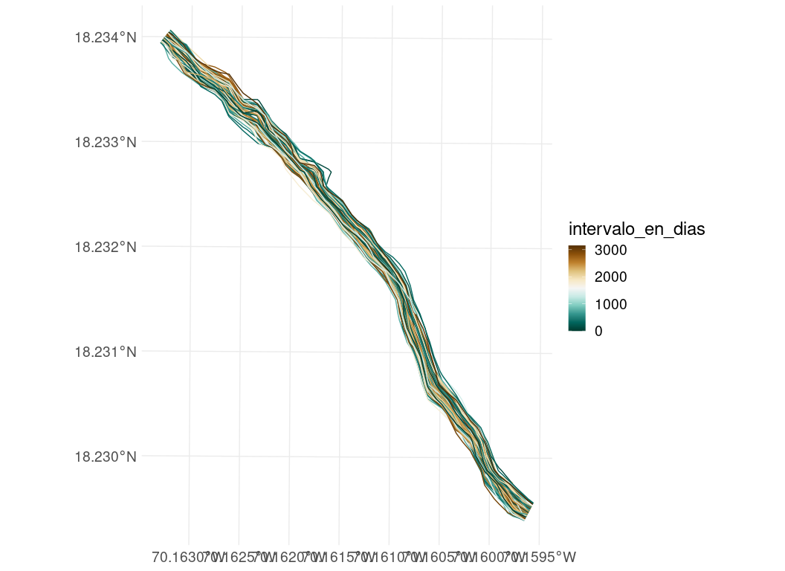<!-- -->

- Crear transectos respecto de línea de costa de referencia y
  representarlos

``` r
# Umbral de longitud para líneas que podrían usarse como referencia
umbral_longitud <- 100

# Elegir una línea de referencia
linea_ref <- lineas %>% filter(longitud > umbral_longitud) %>% filter(date == min(date, na.rm = T))

# Crear transectos
transectos <- create_transect(x = linea_ref, 100, reverse = T) %>% rename(transect=coastr_id)

# Mapa
mapa_lineas + geom_sf(data = transectos, color = 'blue')
```

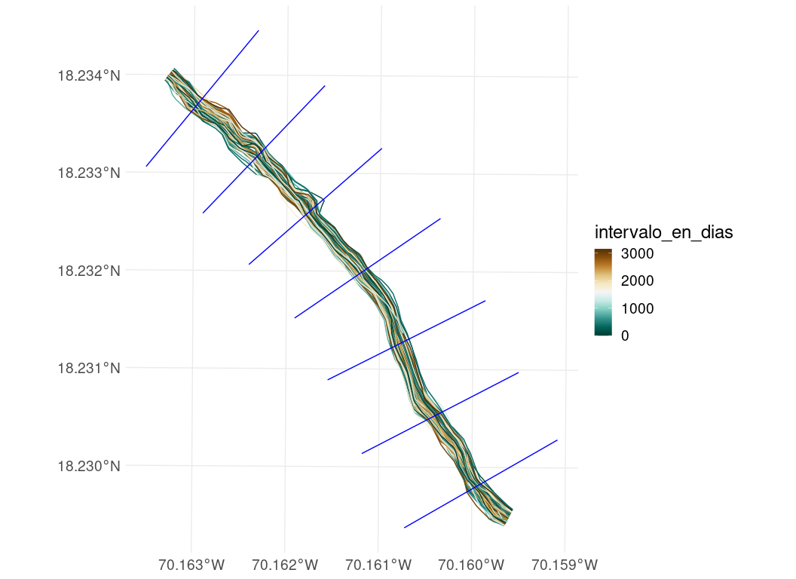<!-- -->

- Clasificar las distintas partes del transecto en tierra o mar

``` r
transectos_clasif <- transclas(tr = transectos, rl = linea_ref)
```

    ## Warning: attribute variables are assumed to be spatially constant throughout all
    ## geometries

    ## Warning: attribute variables are assumed to be spatially constant throughout all
    ## geometries

    ## Warning in st_cast.sf(tmultiline, "LINESTRING"): repeating attributes for all
    ## sub-geometries for which they may not be constant

``` r
cols <- colorRampPalette(brewer.pal(9,'Set1'))(nrow(lineas))
ggplot() +
  geom_sf(data = lineas %>% mutate(date = factor(date)), color = cols) +
  geom_sf(
    data = linea_ref %>% mutate(linetype = paste0('Ref. (', date, ')')),
    aes(color=linetype), linewidth = 2, show.legend = 'line') +
  geom_sf(
    data = transectos_clasif %>% mutate(sealand=paste0('Transect: ', sealand)),
    aes(color = sealand), show.legend = 'line', linewidth = 4) +
  scale_color_manual(values = c('black', 'orange', 'blue')) +
  geom_sf_text(
    data = transectos_clasif %>% filter(sealand=='landward') %>%
      st_centroid, aes(label = transect), size = 8) +
  theme_minimal() +
  theme(legend.title = element_blank(), text = element_text(size = 18))
```

    ## Warning: Ignoring unknown parameters: linewidth

    ## Warning: Ignoring unknown parameters: linewidth

    ## Warning in st_centroid.sf(.): st_centroid assumes attributes are constant over
    ## geometries of x

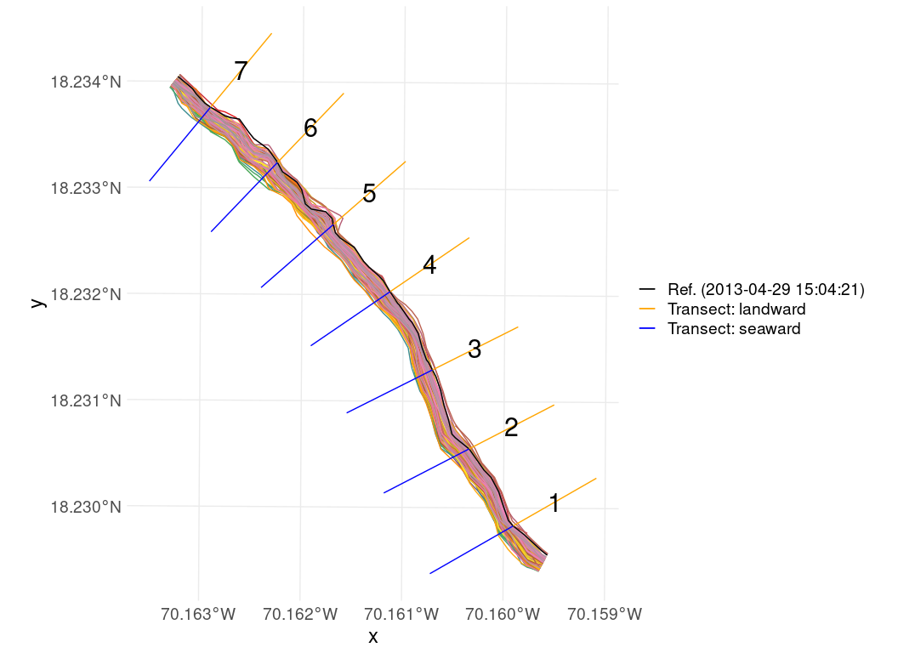<!-- -->

- Calcular distancias de cada línea de costa respecto de la línea de
  referencia

``` r
distl <- pointdist(sh = lineas, re = linea_ref, tr = transectos_clasif, rtr = transectos)
```

    ## Warning: attribute variables are assumed to be spatially constant throughout all
    ## geometries

    ## Warning: attribute variables are assumed to be spatially constant throughout all
    ## geometries

- Generar las series temporales de distancia de la línea de costa
  respecto a la de referencia

``` r
interdist <- map(distl, interpolate) %>% plyr::ldply() %>% mutate(date = as.Date(date, "%Y-%m-%d"))
distances <- plyr::ldply(distl) %>% mutate(date = as.Date(date, "%Y-%m-%d"))
distances %>% 
  ggplot() + theme_bw() + aes(x = date, y = distance_sign) +
  geom_ribbon(data = interdist, aes(ymax = pmax(distance_sign, 0), ymin = 0), fill = "sienna3") +
  geom_ribbon(data = interdist, aes(ymin = pmin(distance_sign, 0), ymax = 0), fill = "skyblue3") +
  geom_hline(yintercept = 0, color = 'grey') +
  geom_line(colour='black', lwd = 0.5) +
  scale_x_date(date_labels = "%Y", date_breaks = '1 year') +
#   scale_y_continuous(limits = c(-30, 30)) +
  theme(axis.text.x = element_text(angle = 90, vjust = 0.5), text = element_text(size = 14)) +
  facet_wrap(~transect, ncol = 2)
```

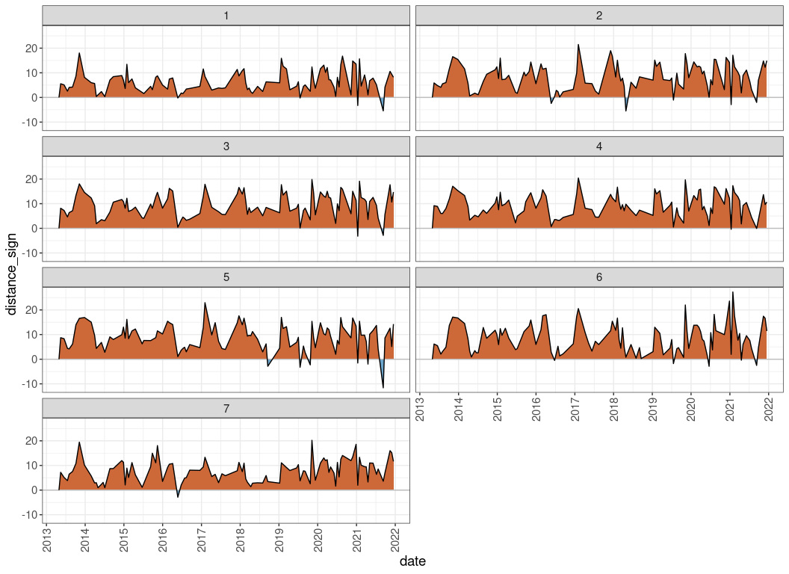<!-- -->

- Revisión de seguridad: determinar si hay transectos que corten dos
  veces una misma línea de costa

``` r
test <- sapply(unique(distances$transect), function(x) {
    conteo_cortes <- table(distances[distances$transect==x, 'date', drop=T])
    mas_de_1 <- length(which(conteo_cortes>1))>0
    ifelse(mas_de_1,
          paste('El transecto', x, 'corta', conteo_cortes[which(conteo_cortes>1)],
                 'veces la línea de costa de fecha', names(conteo_cortes[which(conteo_cortes>1)])),
          paste('El transecto', x, 'pasa la prueba'))
})
test
```

    ## [1] "El transecto 1 pasa la prueba" "El transecto 2 pasa la prueba"
    ## [3] "El transecto 3 pasa la prueba" "El transecto 4 pasa la prueba"
    ## [5] "El transecto 5 pasa la prueba" "El transecto 6 pasa la prueba"
    ## [7] "El transecto 7 pasa la prueba"

- Suavizado de la serie con media móvil

``` r
ventana_de_promediado <- 3 #Número de observaciones para obtener la media movil (ventana de promediado)
distl_med <- sapply(unique(distances$transect),
       function(x){
           df <- distances[distances$transect==x, ]
           df <- df[order(df$date), ]
           x <- zoo(df$distance_sign, df$date)
           mm <- as.numeric(rollmean(x, ventana_de_promediado, fill = NA))
           df$distance_sign <- mm
           df <- df #%>% slice(1:(n()-1))
           return(df)
       }, simplify=F)
interdist_med <- map(distl_med, interpolate) %>% plyr::ldply() %>% mutate(date = as.Date(date, "%Y-%m-%d"))
distances_med <- plyr::ldply(distl_med) %>% mutate(date = as.Date(date, "%Y-%m-%d"))
```

- Representación de la serie suavizada

``` r
distances_med %>% 
  ggplot() + theme_bw() + aes(x = date, y = distance_sign) +
  geom_ribbon(data = interdist_med, aes(ymax = pmax(distance_sign, 0), ymin = 0), fill = "sienna3") +
  geom_ribbon(data = interdist_med, aes(ymin = pmin(distance_sign, 0), ymax = 0), fill = "skyblue3") +
  geom_hline(yintercept = 0, color = 'grey') +
  geom_line(colour='black', lwd = 0.5) +
  scale_x_date(date_labels = "%Y", date_breaks = '1 year') +
  theme(axis.text.x = element_text(angle = 90, vjust = 0.5), text = element_text(size = 14)) +
  facet_wrap(~transect, ncol = 2)
```

    ## Warning: Removed 2 row(s) containing missing values (geom_path).

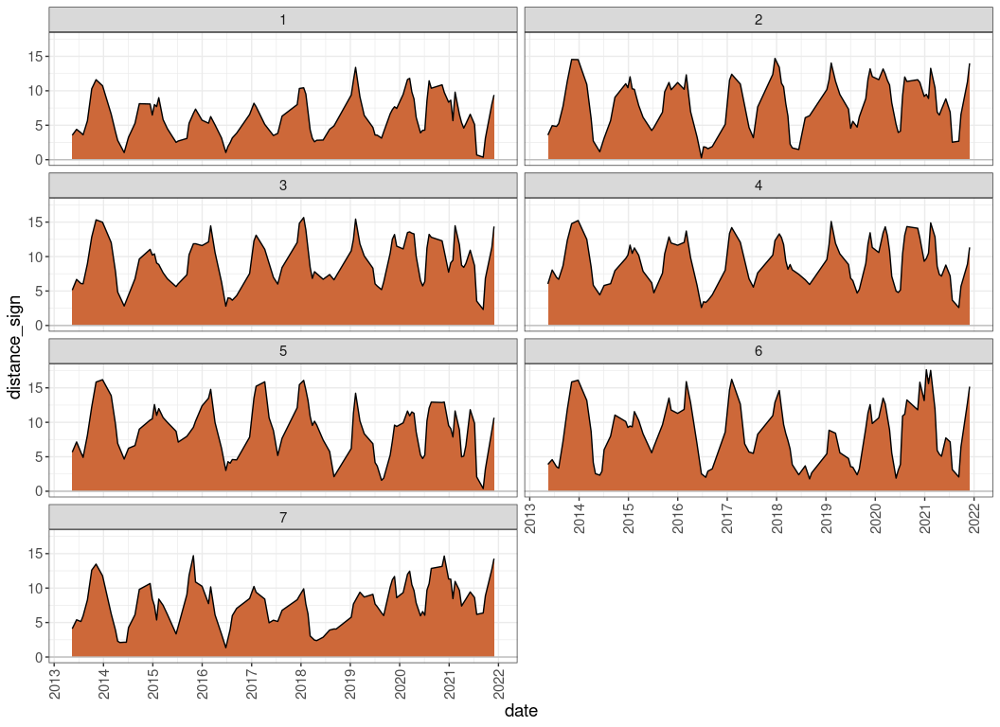<!-- -->

### Tramo Palenque Centro

- Cargar líneas de costa

``` r
lineas <- st_read('lineas-de-costa/PalenqueNizaoPC_L8_output_lines.gpkg') %>%
  filter(grepl('palenque centro', tramo, ignore.case = T)) %>%
  st_cast('LINESTRING')
```

    ## Reading layer `PalenqueNizaoPC_L8_output_lines' from data source 
    ##   `/home/jose/Documentos/git/tesis-ana-carolain/lineas-de-costa/PalenqueNizaoPC_L8_output_lines.gpkg' 
    ##   using driver `GPKG'
    ## Simple feature collection with 483 features and 5 fields
    ## Geometry type: LINESTRING
    ## Dimension:     XY
    ## Bounding box:  xmin: 368857.5 ymin: 2015230 xmax: 377399 ymax: 2016803
    ## Projected CRS: WGS 84 / UTM zone 19N

``` r
st_geometry(lineas) <- "geometry"
lineas$longitud <- units::drop_units(st_length(lineas))
lineas <- lineas[lineas$longitud > 0, ]
```

- Representar las líneas de costa

``` r
lineas$intervalo_en_dias <- round(as.numeric(interval(lineas$date, max(lineas$date)), 'days'), 0)
escala_color <- 'BrBG'
mapa_lineas <- lineas %>% ggplot + aes(color=intervalo_en_dias) + geom_sf() +
  theme_minimal() +
  theme(text = element_text(size = 18)) +
  scale_color_gradientn(colors = rev(RColorBrewer::brewer.pal(11, escala_color)))
mapa_lineas
```

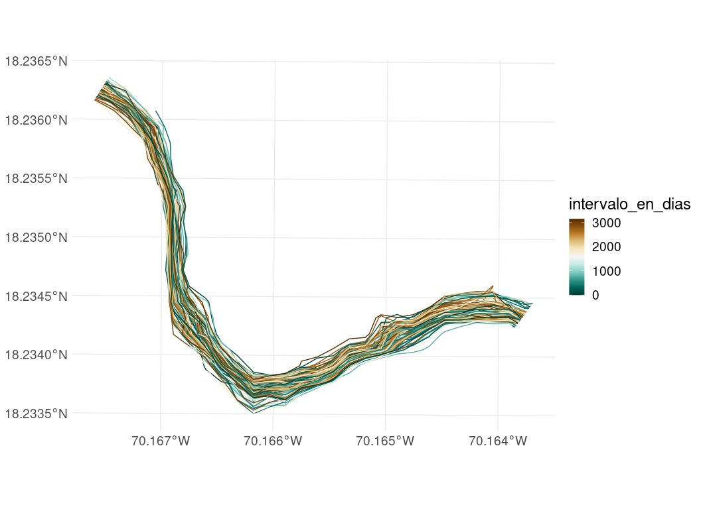<!-- -->

- Crear transectos respecto de línea de costa de referencia y
  representarlos

``` r
# Umbral de longitud para líneas que podrían usarse como referencia
umbral_longitud <- 300

# Elegir una línea de referencia
linea_ref <- lineas %>% filter(longitud > umbral_longitud) %>% filter(date == min(date, na.rm = T))

# Crear transectos
transectos <- create_transect(x = linea_ref, 100, reverse = T) %>% rename(transect=coastr_id)

# Mapa
mapa_lineas + geom_sf(data = transectos, color = 'blue')
```

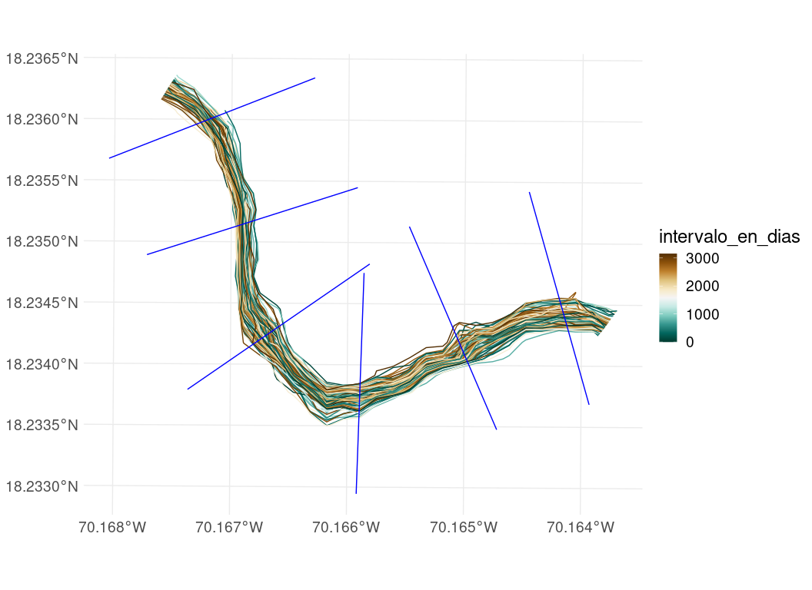<!-- -->

- Clasificar las distintas partes del transecto en tierra o mar

``` r
transectos_clasif <- transclas(tr = transectos, rl = linea_ref)
```

    ## Warning: attribute variables are assumed to be spatially constant throughout all
    ## geometries

    ## Warning: attribute variables are assumed to be spatially constant throughout all
    ## geometries

    ## Warning in st_cast.sf(tmultiline, "LINESTRING"): repeating attributes for all
    ## sub-geometries for which they may not be constant

``` r
cols <- colorRampPalette(brewer.pal(9,'Set1'))(nrow(lineas))
ggplot() +
  geom_sf(data = lineas %>% mutate(date = factor(date)), color = cols) +
  geom_sf(
    data = linea_ref %>% mutate(linetype = paste0('Ref. (', date, ')')),
    aes(color=linetype), linewidth = 2, show.legend = 'line') +
  geom_sf(
    data = transectos_clasif %>% mutate(sealand=paste0('Transect: ', sealand)),
    aes(color = sealand), show.legend = 'line', linewidth = 4) +
  scale_color_manual(values = c('black', 'orange', 'blue')) +
  geom_sf_text(
    data = transectos_clasif %>% filter(sealand=='landward') %>%
      st_centroid, aes(label = transect), size = 8) +
  theme_minimal() +
  theme(legend.title = element_blank(), text = element_text(size = 18))
```

    ## Warning: Ignoring unknown parameters: linewidth

    ## Warning: Ignoring unknown parameters: linewidth

    ## Warning in st_centroid.sf(.): st_centroid assumes attributes are constant over
    ## geometries of x

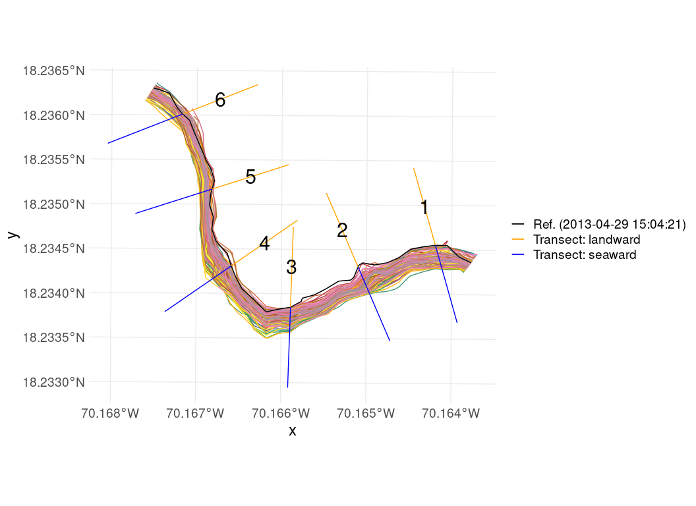<!-- -->

- Calcular distancias de cada línea de costa respecto de la línea de
  referencia

``` r
distl <- pointdist(sh = lineas, re = linea_ref, tr = transectos_clasif, rtr = transectos)
```

    ## Warning: attribute variables are assumed to be spatially constant throughout all
    ## geometries

    ## Warning: attribute variables are assumed to be spatially constant throughout all
    ## geometries

- Generar las series temporales de distancia de la línea de costa
  respecto a la de referencia

``` r
interdist <- map(distl, interpolate) %>% plyr::ldply() %>% mutate(date = as.Date(date, "%Y-%m-%d"))
distances <- plyr::ldply(distl) %>% mutate(date = as.Date(date, "%Y-%m-%d"))
distances %>% 
  ggplot() + theme_bw() + aes(x = date, y = distance_sign) +
  geom_ribbon(data = interdist, aes(ymax = pmax(distance_sign, 0), ymin = 0), fill = "sienna3") +
  geom_ribbon(data = interdist, aes(ymin = pmin(distance_sign, 0), ymax = 0), fill = "skyblue3") +
  geom_hline(yintercept = 0, color = 'grey') +
  geom_line(colour='black', lwd = 0.5) +
  scale_x_date(date_labels = "%Y", date_breaks = '1 year') +
#   scale_y_continuous(limits = c(-30, 30)) +
  theme(axis.text.x = element_text(angle = 90, vjust = 0.5), text = element_text(size = 14)) +
  facet_wrap(~transect, ncol = 2)
```

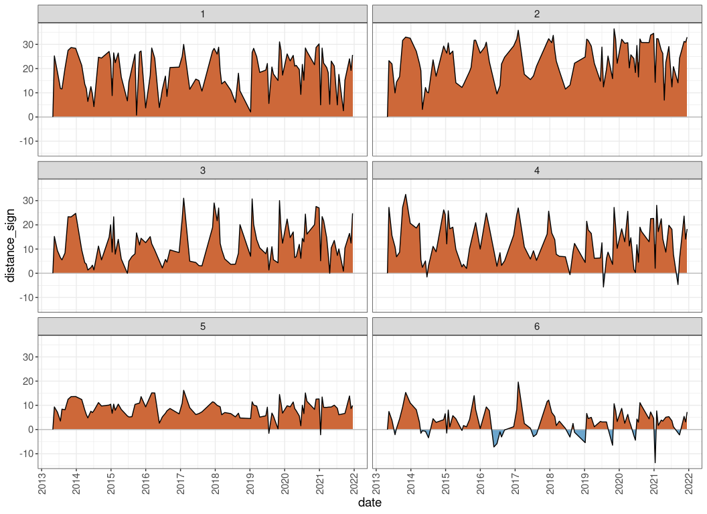<!-- -->

- Revisión de seguridad: determinar si hay transectos que corten dos
  veces una misma línea de costa

``` r
test <- sapply(unique(distances$transect), function(x) {
    conteo_cortes <- table(distances[distances$transect==x, 'date', drop=T])
    mas_de_1 <- length(which(conteo_cortes>1))>0
    ifelse(mas_de_1,
          paste('El transecto', x, 'corta', conteo_cortes[which(conteo_cortes>1)],
                 'veces la línea de costa de fecha', names(conteo_cortes[which(conteo_cortes>1)])),
          paste('El transecto', x, 'pasa la prueba'))
})
test
```

    ## [1] "El transecto 1 pasa la prueba" "El transecto 2 pasa la prueba"
    ## [3] "El transecto 3 pasa la prueba" "El transecto 4 pasa la prueba"
    ## [5] "El transecto 5 pasa la prueba" "El transecto 6 pasa la prueba"

- Suavizado de la serie con media móvil

``` r
ventana_de_promediado <- 3 #Número de observaciones para obtener la media movil (ventana de promediado)
distl_med <- sapply(unique(distances$transect),
       function(x){
           df <- distances[distances$transect==x, ]
           df <- df[order(df$date), ]
           x <- zoo(df$distance_sign, df$date)
           mm <- as.numeric(rollmean(x, ventana_de_promediado, fill = NA))
           df$distance_sign <- mm
           df <- df #%>% slice(1:(n()-1))
           return(df)
       }, simplify=F)
interdist_med <- map(distl_med, interpolate) %>% plyr::ldply() %>% mutate(date = as.Date(date, "%Y-%m-%d"))
distances_med <- plyr::ldply(distl_med) %>% mutate(date = as.Date(date, "%Y-%m-%d"))
```

- Representación de la serie suavizada

``` r
distances_med %>% 
  ggplot() + theme_bw() + aes(x = date, y = distance_sign) +
  geom_ribbon(data = interdist_med, aes(ymax = pmax(distance_sign, 0), ymin = 0), fill = "sienna3") +
  geom_ribbon(data = interdist_med, aes(ymin = pmin(distance_sign, 0), ymax = 0), fill = "skyblue3") +
  geom_hline(yintercept = 0, color = 'grey') +
  geom_line(colour='black', lwd = 0.5) +
  scale_x_date(date_labels = "%Y", date_breaks = '1 year') +
  theme(axis.text.x = element_text(angle = 90, vjust = 0.5), text = element_text(size = 14)) +
  facet_wrap(~transect, ncol = 2)
```

    ## Warning: Removed 2 row(s) containing missing values (geom_path).

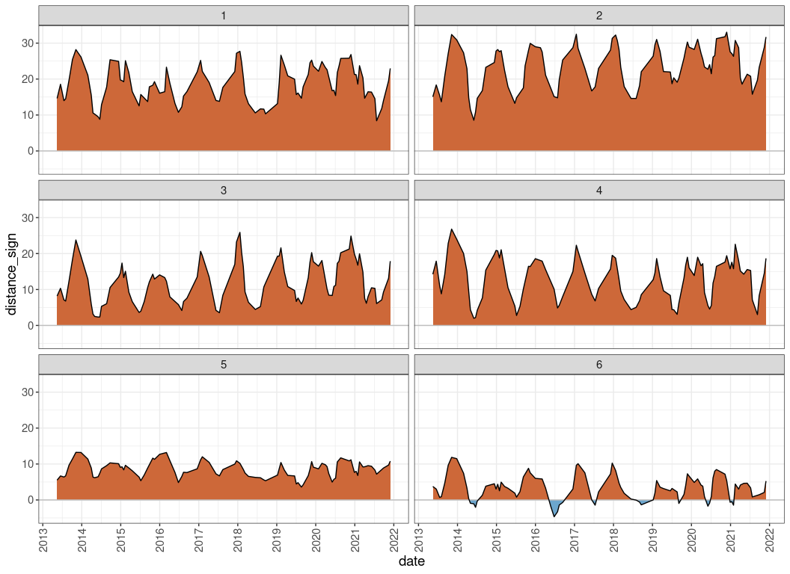<!-- -->

### Tramo Palenque Oeste

- Cargar líneas de costa

``` r
lineas <- st_read('lineas-de-costa/PalenqueNizaoPC_L8_output_lines.gpkg') %>%
  filter(grepl('palenque oeste', tramo, ignore.case = T)) %>%
  st_cast('LINESTRING')
```

    ## Reading layer `PalenqueNizaoPC_L8_output_lines' from data source 
    ##   `/home/jose/Documentos/git/tesis-ana-carolain/lineas-de-costa/PalenqueNizaoPC_L8_output_lines.gpkg' 
    ##   using driver `GPKG'
    ## Simple feature collection with 483 features and 5 fields
    ## Geometry type: LINESTRING
    ## Dimension:     XY
    ## Bounding box:  xmin: 368857.5 ymin: 2015230 xmax: 377399 ymax: 2016803
    ## Projected CRS: WGS 84 / UTM zone 19N

``` r
st_geometry(lineas) <- "geometry"
lineas$longitud <- units::drop_units(st_length(lineas))
lineas <- lineas[lineas$longitud > 0, ]
```

- Representar las líneas de costa

``` r
lineas$intervalo_en_dias <- round(as.numeric(interval(lineas$date, max(lineas$date)), 'days'), 0)
escala_color <- 'BrBG'
mapa_lineas <- lineas %>% ggplot + aes(color=intervalo_en_dias) + geom_sf() +
  theme_minimal() +
  theme(text = element_text(size = 18)) +
  scale_color_gradientn(colors = rev(RColorBrewer::brewer.pal(11, escala_color)))
mapa_lineas
```

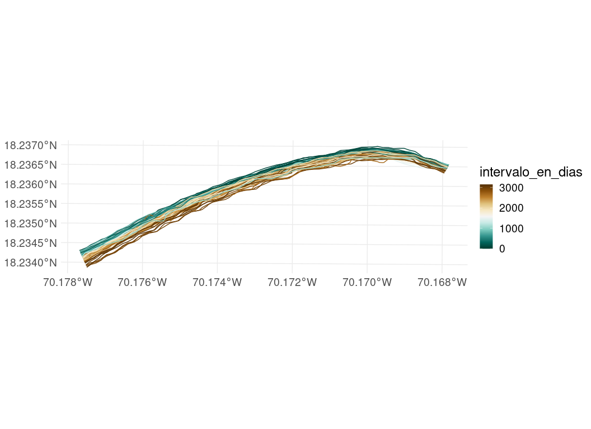<!-- -->

- Crear transectos respecto de línea de costa de referencia y
  representarlos

``` r
# Umbral de longitud para líneas que podrían usarse como referencia
umbral_longitud <- 800

# Elegir una línea de referencia
linea_ref <- lineas %>% filter(longitud > umbral_longitud) %>% filter(date == min(date, na.rm = T))

# Crear transectos
transectos <- create_transect(x = linea_ref, 200, reverse = T) %>% rename(transect=coastr_id)

# Mapa
mapa_lineas + geom_sf(data = transectos, color = 'blue')
```

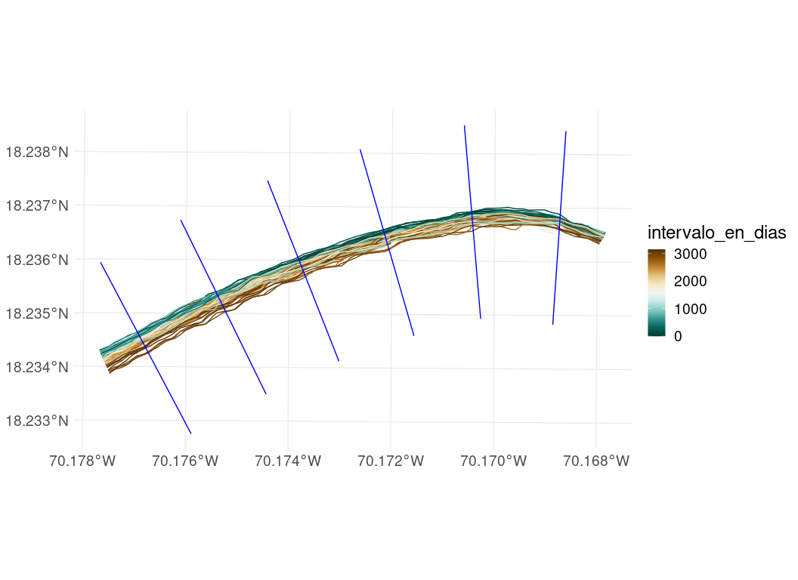<!-- -->

- Clasificar las distintas partes del transecto en tierra o mar

``` r
transectos_clasif <- transclas(tr = transectos, rl = linea_ref)
```

    ## Warning: attribute variables are assumed to be spatially constant throughout all
    ## geometries

    ## Warning: attribute variables are assumed to be spatially constant throughout all
    ## geometries

    ## Warning in st_cast.sf(tmultiline, "LINESTRING"): repeating attributes for all
    ## sub-geometries for which they may not be constant

``` r
cols <- colorRampPalette(brewer.pal(9,'Set1'))(nrow(lineas))
ggplot() +
  geom_sf(data = lineas %>% mutate(date = factor(date)), color = cols) +
  geom_sf(
    data = linea_ref %>% mutate(linetype = paste0('Ref. (', date, ')')),
    aes(color=linetype), linewidth = 2, show.legend = 'line') +
  geom_sf(
    data = transectos_clasif %>% mutate(sealand=paste0('Transect: ', sealand)),
    aes(color = sealand), show.legend = 'line', linewidth = 4) +
  scale_color_manual(values = c('black', 'orange', 'blue')) +
  geom_sf_text(
    data = transectos_clasif %>% filter(sealand=='landward') %>%
      st_centroid, aes(label = transect), size = 8) +
  theme_minimal() +
  theme(legend.title = element_blank(), text = element_text(size = 18))
```

    ## Warning: Ignoring unknown parameters: linewidth

    ## Warning: Ignoring unknown parameters: linewidth

    ## Warning in st_centroid.sf(.): st_centroid assumes attributes are constant over
    ## geometries of x

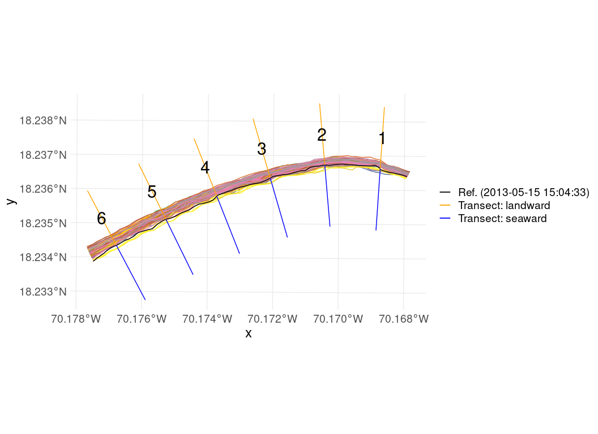<!-- -->

- Calcular distancias de cada línea de costa respecto de la línea de
  referencia

``` r
distl <- pointdist(sh = lineas, re = linea_ref, tr = transectos_clasif, rtr = transectos)
```

    ## Warning: attribute variables are assumed to be spatially constant throughout all
    ## geometries

    ## Warning: attribute variables are assumed to be spatially constant throughout all
    ## geometries

- Generar las series temporales de distancia de la línea de costa
  respecto a la de referencia

``` r
interdist <- map(distl, interpolate) %>% plyr::ldply() %>% mutate(date = as.Date(date, "%Y-%m-%d"))
distances <- plyr::ldply(distl) %>% mutate(date = as.Date(date, "%Y-%m-%d"))
distances %>% 
  ggplot() + theme_bw() + aes(x = date, y = distance_sign) +
  geom_ribbon(data = interdist, aes(ymax = pmax(distance_sign, 0), ymin = 0), fill = "sienna3") +
  geom_ribbon(data = interdist, aes(ymin = pmin(distance_sign, 0), ymax = 0), fill = "skyblue3") +
  geom_hline(yintercept = 0, color = 'grey') +
  geom_line(colour='black', lwd = 0.5) +
  scale_x_date(date_labels = "%Y", date_breaks = '1 year') +
#   scale_y_continuous(limits = c(-30, 30)) +
  theme(axis.text.x = element_text(angle = 90, vjust = 0.5), text = element_text(size = 14)) +
  facet_wrap(~transect, ncol = 2)
```

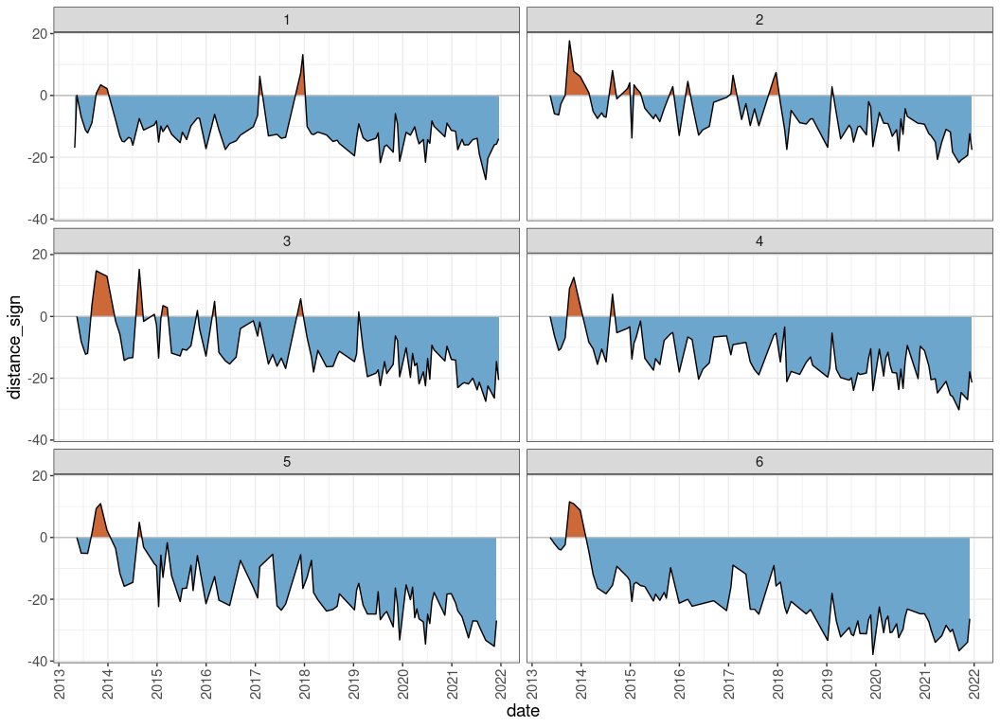<!-- -->

- Revisión de seguridad: determinar si hay transectos que corten dos
  veces una misma línea de costa

``` r
test <- sapply(unique(distances$transect), function(x) {
    conteo_cortes <- table(distances[distances$transect==x, 'date', drop=T])
    mas_de_1 <- length(which(conteo_cortes>1))>0
    ifelse(mas_de_1,
          paste('El transecto', x, 'corta', conteo_cortes[which(conteo_cortes>1)],
                 'veces la línea de costa de fecha', names(conteo_cortes[which(conteo_cortes>1)])),
          paste('El transecto', x, 'pasa la prueba'))
})
test
```

    ## [1] "El transecto 1 pasa la prueba" "El transecto 2 pasa la prueba"
    ## [3] "El transecto 3 pasa la prueba" "El transecto 4 pasa la prueba"
    ## [5] "El transecto 5 pasa la prueba" "El transecto 6 pasa la prueba"

- Suavizado de la serie con media móvil

``` r
ventana_de_promediado <- 3 #Número de observaciones para obtener la media movil (ventana de promediado)
distl_med <- sapply(unique(distances$transect),
       function(x){
           df <- distances[distances$transect==x, ]
           df <- df[order(df$date), ]
           x <- zoo(df$distance_sign, df$date)
           mm <- as.numeric(rollmean(x, ventana_de_promediado, fill = NA))
           df$distance_sign <- mm
           df <- df #%>% slice(1:(n()-1))
           return(df)
       }, simplify=F)
interdist_med <- map(distl_med, interpolate) %>% plyr::ldply() %>% mutate(date = as.Date(date, "%Y-%m-%d"))
distances_med <- plyr::ldply(distl_med) %>% mutate(date = as.Date(date, "%Y-%m-%d"))
```

- Representación de la serie suavizada

``` r
distances_med %>% 
  ggplot() + theme_bw() + aes(x = date, y = distance_sign) +
  geom_ribbon(data = interdist_med, aes(ymax = pmax(distance_sign, 0), ymin = 0), fill = "sienna3") +
  geom_ribbon(data = interdist_med, aes(ymin = pmin(distance_sign, 0), ymax = 0), fill = "skyblue3") +
  geom_hline(yintercept = 0, color = 'grey') +
  geom_line(colour='black', lwd = 0.5) +
  scale_x_date(date_labels = "%Y", date_breaks = '1 year') +
  theme(axis.text.x = element_text(angle = 90, vjust = 0.5), text = element_text(size = 14)) +
  facet_wrap(~transect, ncol = 2)
```

    ## Warning: Removed 2 row(s) containing missing values (geom_path).

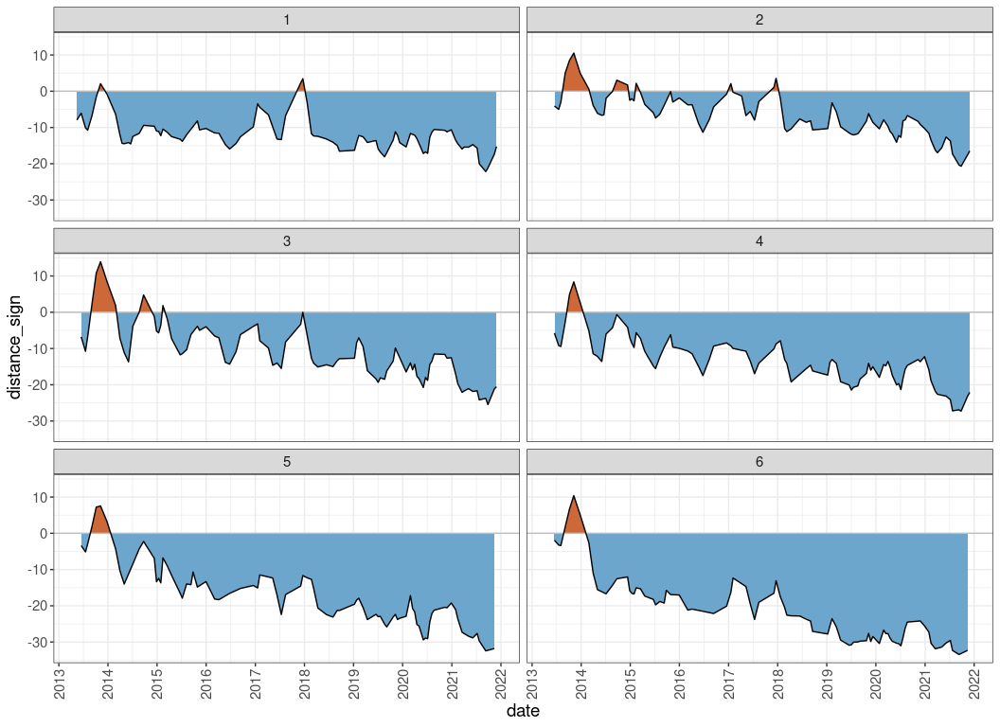<!-- -->

### Tramo Nizao este

NOTA: TENEMOS UN PROBLEMA CON EL EMPLAZAMIENTO DE TRANSECTOS. EL
ALGORITMO NO COLOCA TRANSECTOS EN EL ÁREA CENTRAL. AQUÍ NOS QUEDAMOS.

- Cargar líneas de costa

``` r
lineas <- st_read('lineas-de-costa/PalenqueNizaoPC_L8_output_lines.gpkg') %>%
  filter(grepl('nizao este', tramo, ignore.case = T)) %>%
  st_cast('LINESTRING')
```

    ## Reading layer `PalenqueNizaoPC_L8_output_lines' from data source 
    ##   `/home/jose/Documentos/git/tesis-ana-carolain/lineas-de-costa/PalenqueNizaoPC_L8_output_lines.gpkg' 
    ##   using driver `GPKG'
    ## Simple feature collection with 483 features and 5 fields
    ## Geometry type: LINESTRING
    ## Dimension:     XY
    ## Bounding box:  xmin: 368857.5 ymin: 2015230 xmax: 377399 ymax: 2016803
    ## Projected CRS: WGS 84 / UTM zone 19N

``` r
st_geometry(lineas) <- "geometry"
lineas$longitud <- units::drop_units(st_length(lineas))
lineas <- lineas[lineas$longitud > 0, ]
```

- Representar las líneas de costa

``` r
lineas$intervalo_en_dias <- round(as.numeric(interval(lineas$date, max(lineas$date)), 'days'), 0)
escala_color <- 'BrBG'
mapa_lineas <- lineas %>% ggplot + aes(color=intervalo_en_dias) + geom_sf() +
  theme_minimal() +
  theme(text = element_text(size = 18)) +
  scale_color_gradientn(colors = rev(RColorBrewer::brewer.pal(11, escala_color)))
mapa_lineas
```

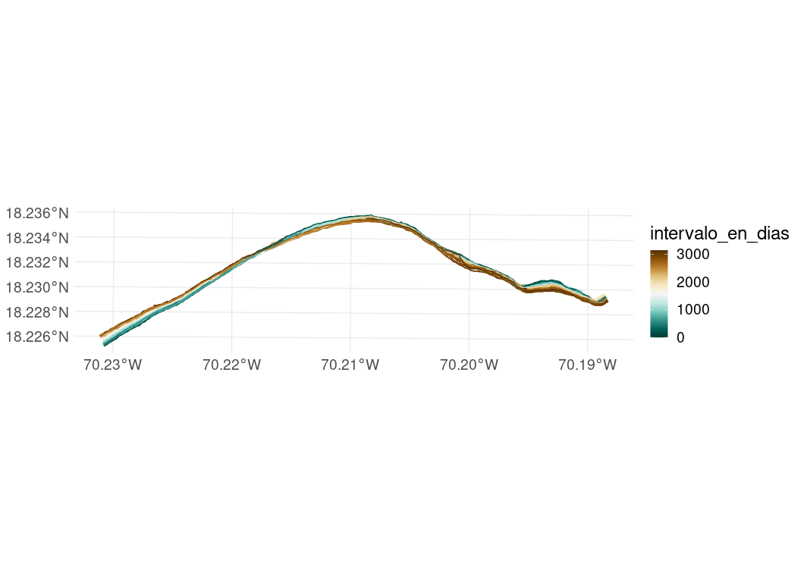<!-- -->

- Crear transectos respecto de línea de costa de referencia y
  representarlos

``` r
# Umbral de longitud para líneas que podrían usarse como referencia
umbral_longitud <- 1000

# Elegir una línea de referencia
linea_ref <- lineas %>% filter(longitud > umbral_longitud) %>% filter(date == "2013-08-03 15:04:35 AST")

# Crear transectos
transectos <- create_transect(x = linea_ref, 400, reverse = T) %>% rename(transect=coastr_id)

# Mapa
mapa_lineas + geom_sf(data = transectos, color = 'blue')
```

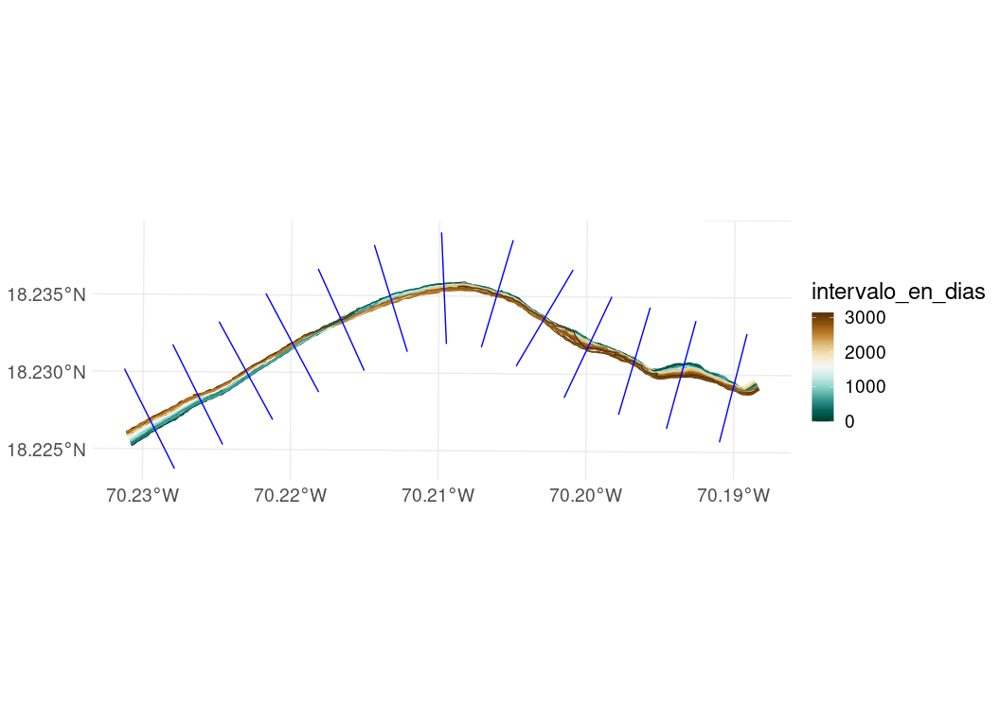<!-- -->

- Clasificar las distintas partes del transecto en tierra o mar

``` r
transectos_clasif <- transclas(tr = transectos, rl = linea_ref)
```

    ## Warning: attribute variables are assumed to be spatially constant throughout all
    ## geometries

    ## Warning: attribute variables are assumed to be spatially constant throughout all
    ## geometries

    ## Warning in st_cast.sf(tmultiline, "LINESTRING"): repeating attributes for all
    ## sub-geometries for which they may not be constant

``` r
cols <- colorRampPalette(brewer.pal(9,'Set1'))(nrow(lineas))
ggplot() +
  geom_sf(data = lineas %>% mutate(date = factor(date)), color = cols) +
  geom_sf(
    data = linea_ref %>% mutate(linetype = paste0('Ref. (', date, ')')),
    aes(color=linetype), linewidth = 2, show.legend = 'line') +
  geom_sf(
    data = transectos_clasif %>% mutate(sealand=paste0('Transect: ', sealand)),
    aes(color = sealand), show.legend = 'line', linewidth = 4) +
  scale_color_manual(values = c('black', 'orange', 'blue')) +
  geom_sf_text(
    data = transectos_clasif %>% filter(sealand=='landward') %>%
      st_centroid, aes(label = transect), size = 8) +
  theme_minimal() +
  theme(legend.title = element_blank(), text = element_text(size = 18))
```

    ## Warning: Ignoring unknown parameters: linewidth

    ## Warning: Ignoring unknown parameters: linewidth

    ## Warning in st_centroid.sf(.): st_centroid assumes attributes are constant over
    ## geometries of x

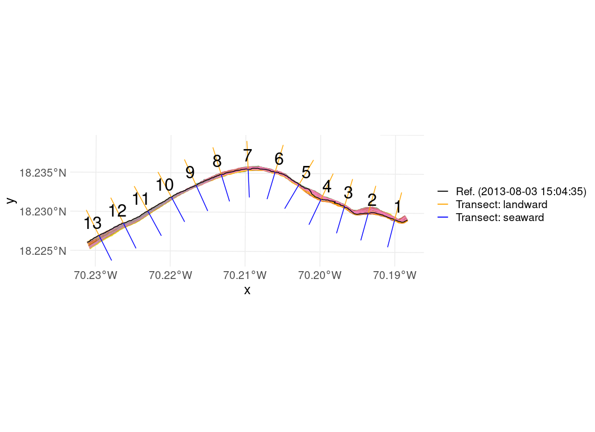<!-- -->

- Calcular distancias de cada línea de costa respecto de la línea de
  referencia

``` r
distl <- pointdist(sh = lineas, re = linea_ref, tr = transectos_clasif, rtr = transectos)
```

    ## Warning: attribute variables are assumed to be spatially constant throughout all
    ## geometries

    ## Warning: attribute variables are assumed to be spatially constant throughout all
    ## geometries

- Generar las series temporales de distancia de la línea de costa
  respecto a la de referencia

``` r
interdist <- map(distl, interpolate) %>% plyr::ldply() %>% mutate(date = as.Date(date, "%Y-%m-%d"))
distances <- plyr::ldply(distl) %>% mutate(date = as.Date(date, "%Y-%m-%d"))
distances %>% 
  ggplot() + theme_bw() + aes(x = date, y = distance_sign) +
  geom_ribbon(data = interdist, aes(ymax = pmax(distance_sign, 0), ymin = 0), fill = "sienna3") +
  geom_ribbon(data = interdist, aes(ymin = pmin(distance_sign, 0), ymax = 0), fill = "skyblue3") +
  geom_hline(yintercept = 0, color = 'grey') +
  geom_line(colour='black', lwd = 0.5) +
  scale_x_date(date_labels = "%Y", date_breaks = '1 year') +
#   scale_y_continuous(limits = c(-30, 30)) +
  theme(axis.text.x = element_text(angle = 90, vjust = 0.5), text = element_text(size = 14)) +
  facet_wrap(~transect, ncol = 2)
```

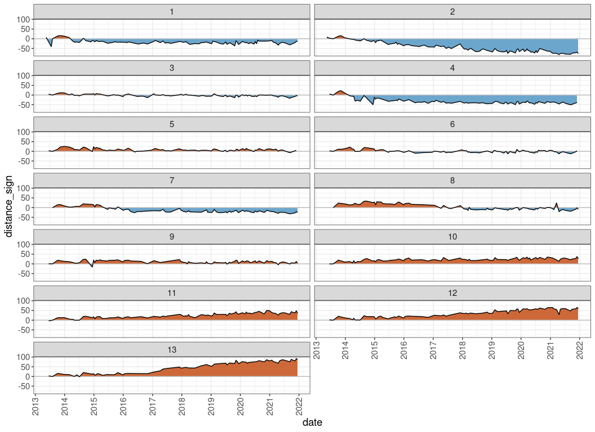<!-- -->

- Revisión de seguridad: determinar si hay transectos que corten dos
  veces una misma línea de costa

``` r
test <- sapply(unique(distances$transect), function(x) {
    conteo_cortes <- table(distances[distances$transect==x, 'date', drop=T])
    mas_de_1 <- length(which(conteo_cortes>1))>0
    ifelse(mas_de_1,
          paste('El transecto', x, 'corta', conteo_cortes[which(conteo_cortes>1)],
                 'veces la línea de costa de fecha', names(conteo_cortes[which(conteo_cortes>1)])),
          paste('El transecto', x, 'pasa la prueba'))
})
test
```

    ##  [1] "El transecto 1 pasa la prueba"  "El transecto 2 pasa la prueba" 
    ##  [3] "El transecto 3 pasa la prueba"  "El transecto 4 pasa la prueba" 
    ##  [5] "El transecto 5 pasa la prueba"  "El transecto 6 pasa la prueba" 
    ##  [7] "El transecto 7 pasa la prueba"  "El transecto 8 pasa la prueba" 
    ##  [9] "El transecto 9 pasa la prueba"  "El transecto 10 pasa la prueba"
    ## [11] "El transecto 11 pasa la prueba" "El transecto 12 pasa la prueba"
    ## [13] "El transecto 13 pasa la prueba"

- Suavizado de la serie con media móvil

``` r
ventana_de_promediado <- 3 #Número de observaciones para obtener la media movil (ventana de promediado)
distl_med <- sapply(unique(distances$transect),
       function(x){
           df <- distances[distances$transect==x, ]
           df <- df[order(df$date), ]
           x <- zoo(df$distance_sign, df$date)
           mm <- as.numeric(rollmean(x, ventana_de_promediado, fill = NA))
           df$distance_sign <- mm
           df <- df #%>% slice(1:(n()-1))
           return(df)
       }, simplify=F)
interdist_med <- map(distl_med, interpolate) %>% plyr::ldply() %>% mutate(date = as.Date(date, "%Y-%m-%d"))
distances_med <- plyr::ldply(distl_med) %>% mutate(date = as.Date(date, "%Y-%m-%d"))
```

- Representación de la serie suavizada

``` r
distances_med %>% 
  ggplot() + theme_bw() + aes(x = date, y = distance_sign) +
  geom_ribbon(data = interdist_med, aes(ymax = pmax(distance_sign, 0), ymin = 0), fill = "sienna3") +
  geom_ribbon(data = interdist_med, aes(ymin = pmin(distance_sign, 0), ymax = 0), fill = "skyblue3") +
  geom_hline(yintercept = 0, color = 'grey') +
  geom_line(colour='black', lwd = 0.5) +
  scale_x_date(date_labels = "%Y", date_breaks = '1 year') +
  theme(axis.text.x = element_text(angle = 90, vjust = 0.5), text = element_text(size = 14)) +
  facet_wrap(~transect, ncol = 3)
```

    ## Warning: Removed 2 row(s) containing missing values (geom_path).

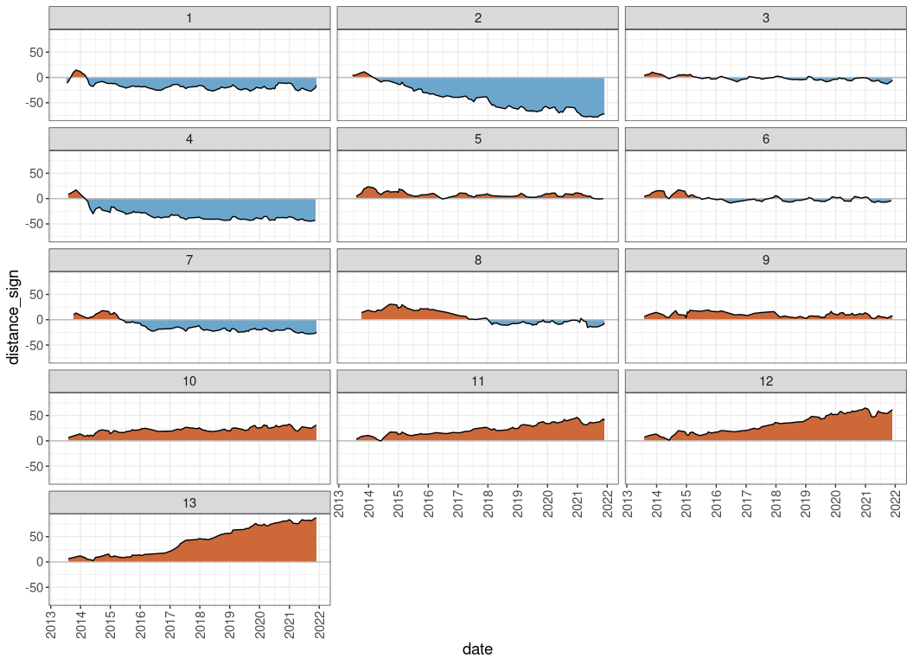<!-- -->

## Pos-2015 (Sentinel 2)

## Referencias

GBIF.org (2023). *What is GBIF?* Retrieved from
<https://www.gbif.org/what-is-gbif>

H3 (2022). *Introduction \| H3*. Retrieved from <https://h3geo.org/docs>

José Ramón Martínez-Batlle (2022). Estadística zonal multipropósito
sobre información geoespacial de República Dominicana, usando Google
Earth Engine, Python y R. Versión “Let there be environmental variables
(v0.0.0.9000)”. Zenodo <https://doi.org/10.5281/zenodo.7367256>
